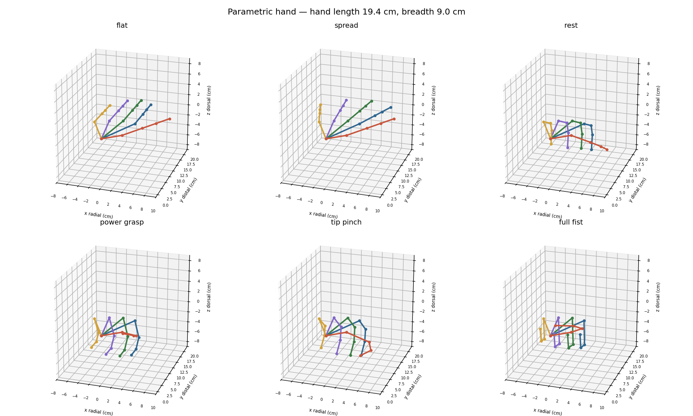

# hand-kinematics

A parametric human hand for glove and exoskeleton design: anthropometric data,
range-of-motion constraints, an interactive pose bench, and CAD export.

Built for a motion-capture glove, but nothing here is specific to one. If you
are designing anything that goes on a hand, the useful part is that the joint
limits and segment proportions come from measured data rather than from
eyeballing a photograph.

**[→ Open the interactive bench](https://ernestwang31.github.io/hand-kinematics/)**



## What's here

| | |
|---|---|
| [`hand_model.yaml`](hand_model.yaml) | the model: segment ratios, joint limits, coupling rules, size presets |
| [`hand_kinematics.py`](hand_kinematics.py) | forward kinematics, constraint checking, workspace sampling |
| [`hand_explorer.html`](hand_explorer.html) | interactive bench — **[open it](https://ernestwang31.github.io/hand-kinematics/)**, or run it locally |
| [`hand_export.py`](hand_export.py) | STEP B-rep solids, STL, joint frames |
| [`hand_envelope.py`](hand_envelope.py) | swept motion envelopes as keep-out bodies |
| [`hand_onshape.py`](hand_onshape.py) | articulated export, one solid per bone, mate-ready |
| [`onshape_bridge.py`](onshape_bridge.py) | push poses into an Onshape assembly over the REST API |
| [`pose.example.json`](pose.example.json) | a pose exported from the bench, input to the CAD tools |
| [`hand_anthropometry.md`](hand_anthropometry.md) | the research: sources, tables, derivations, caveats |
| [`data/greiner_hand_1988.csv`](data/greiner_hand_1988.csv) | 86 hand measurements, 1304 women and 1003 men |

## Install

```bash
pip install -r requirements.txt
```

The bench exports STEP on its own — **Download STEP** loads OpenCascade as
WebAssembly and writes real B-rep solids in the browser, no Python needed. The
command-line tools below are for batch work: every pose and every size at once,
motion envelopes, and the articulated build for CAD assembly.

Only `numpy` and `pyyaml` are needed for the kinematics. CAD export pulls in
CadQuery (OpenCascade); envelopes add scikit-image and trimesh. The web bench
has no dependencies at all — open the HTML file, or use the hosted copy at
**<https://ernestwang31.github.io/hand-kinematics/>**.

## Quick start

```bash
python3 hand_kinematics.py --subject m95 --workspace   # check the model, render poses
python3 hand_export.py --all-poses --clearance 2       # STEP solids + glove-liner offsets
python3 hand_envelope.py --subject m95                 # keep-out volumes
python3 hand_onshape.py --subject m50                  # articulated, for assembly in CAD
```

Coordinate frame for every export, in millimetres: origin at the midpoint of the
distal wrist crease, **+X** radial toward the thumb, **+Y** distal, **+Z**
dorsal. Right hand; mirror across X for the left.

## Where the numbers come from

Primarily **Greiner, T.M. (1991), _Hand Anthropometry of U.S. Army Personnel_,
NATICK/TR-92/011** — 1304 women, 1003 men, and unusually it reports *link
lengths*, joint centre to joint centre, which is what a kinematic chain needs.
ANSUR II is newer but carries only gross hand dimensions.

The extraction was validated: for digits 3, 4 and 5 the four segment lengths sum
to Greiner's independently measured tip-to-wrist distance within 0.3 mm, in both
sexes.

Two values in that report do not survive that check and are corrected here —
the index proximal phalanx (his MCP landmark is the palm crease, which sits
proximal to the joint) and the entire thumb decomposition (his thumb proximal
phalanx reads 1.92 cm against a real ~3.1 cm). Both corrections are documented
in [`hand_anthropometry.md`](hand_anthropometry.md#1-the-primary-dataset).
The raw values are preserved unaltered in the CSV.

Range of motion separates **AAOS clinical norms** — conservative pass/fail
thresholds — from **functional maxima**, which is what healthy hands reach. The
model bounds on the latter.

## The constraints that matter

A free 26-DoF hand reaches poses no hand can make. Enforced throughout:

- **DIP is not independent** — `DIP ≈ 0.67 × PIP`, terminal extensor coupling.
- **Abduction collapses with flexion** — `abd_max × (1 − MCP_flex/90)`. A fully
  flexed finger cannot spread at all.
- **Juncturae tendinum** — adjacent MCPs cannot differ by more than ~25–30°.
- **The ulnar metacarpal arch is mobile** — ring CMC ~15°, little CMC ~25°.
  Treating the palm as one rigid body is the commonest source of error when
  retargeting a flat-palm model onto a real grasp.

## Known limits

- The palm is a three-section loft, not a scan — no crease detail, no
  soft-tissue bulging under load.
- Solid volume runs ~10% under water displacement (350 vs 380–420 cm³ for a
  50th-percentile male). Add 1–2 mm clearance for a tight fit.
- Joints are rigid rotations about fixed axes. Real dorsal skin slides several
  mm over the MCP in full flexion.
- The thumb CMC is modelled as two intersecting axes. The real
  trapeziometacarpal flexion and abduction axes neither intersect nor align
  with the saddle, so thumb poses are the least faithful part of the model.

## Licence

Code and documentation: MIT, see [`LICENSE`](LICENSE).

The Greiner data is a work of the US federal government, approved for public
release with unlimited distribution, and is not subject to copyright.
